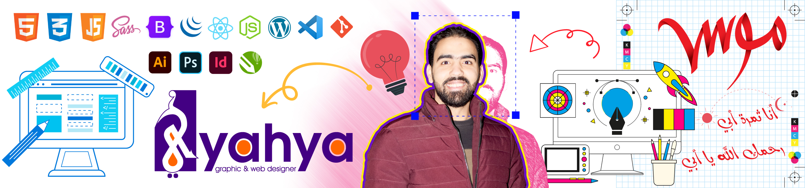

# Hello, folks! 

### I'm Yahya,  
### I used to be Graphic Designer with a tight time! However I always had the passion to build websites, Thanks to this COVID-19 I had the time and the chance to explore the world of Web Development and I quickly fell in love with it 💖 and I'm taking every chance to proceed with my self-learning journey  
### I aspire to become a Full-stack Web Developer, and I do share some of my training/exercise projects and codes here, so Welcome to my profile 😊

<!--
**yahya4242/yahya4242** is a ✨ _special_ ✨ repository because its `README.md` (this file) appears on your GitHub profile.

Here are some ideas to get you started:

- 🔭 I’m currently working on ...
- 🌱 I’m currently learning ...
- 👯 I’m looking to collaborate on ...
- 🤔 I’m looking for help with ...
- 💬 Ask me about ...
- 📫 How to reach me: ...
- 😄 Pronouns: ...
- ⚡ Fun fact: ...
-->
